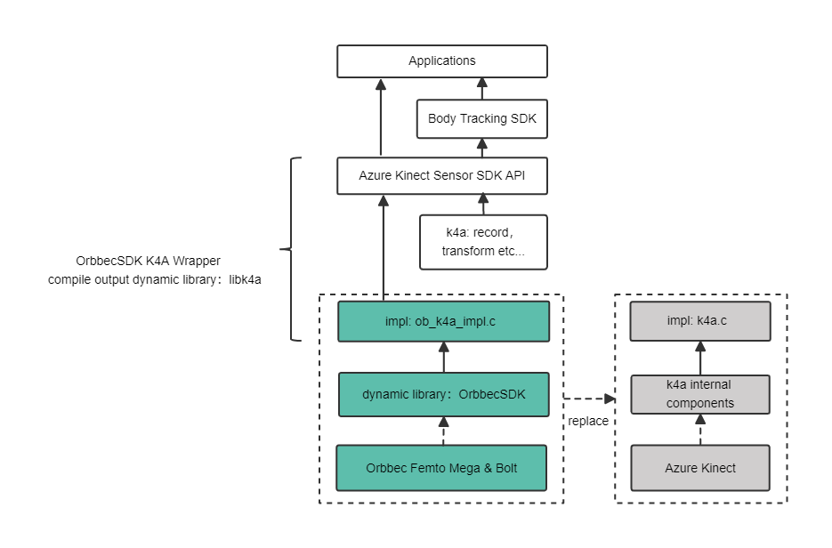

# OrbbecSDK-K4A-Wrapper


This branch is contain the K4A wrapper for OrbbecSDK. It's mean that user can use this library to develop the application with K4A API, but use to access the Orbbec camera.
Also user can use this library to replace native K4A library in your application to access the Orbbec camera without any code change.

*This repo is forked from [Azure Kinect Sensor SDK](https://github.com/microsoft/Azure-Kinect-Sensor-SDK)*

*This branch is base on release/1.4.x, and use new impl code base on [OrbbecSDK](https://github.com/orbbec/OrbbecSDK) to replace the k4a implementation.*

*The usage of this library is same as [Native K4A](./README_K4A.md)*

## What we did?

The [k4a.h](./include/k4a/k4a.h) is the header file of K4A API, and the source code in [k4a.c](./src/sdk/k4a.c) is the implementation of K4A API. We have reimplemented the K4A API in [ob_k4a_impl.c](./src/orbbec/ob_k4a_impl.c) with OrbbecSDK, and keep the same effect as the original K4A API. Therefore, all functions called on user's side will be redirected to the OrbbecSDK, and user can access the Orbbec camera like the K4A device.



## Supported camera and platform

Orbbec Femto Mega: Windows10+, Ubuntu20.04+; x64
Orbbec Femto Bolt: Windows10+, Ubuntu18.04+; x64

*Other Orbbec cameras and platforms without test, don't use it in production environment.*

## How to build

### Get source code

```bash
git clone https://github.com/orbbec/OrbbecSDK-K4A-Wrapper.git
# Please make sure you have switched to the branch with the prefix "ob/", for example: git checkout ob/feature/1.1.x.
git submodule update --init --recursive
```

### Build && install

**It is the same as Native K4A, please refer to: [Building and Dependencies](./docs/building.md)**

Quick Instructions:

* Windows:

    ```powershell
    cd OrbbecSDK-K4A-Wrapper
    mkdir build
    cd build
    cmake .. -G Ninja
    ninja
    ninja install
    ```

* Linux

    ```bash
    cd OrbbecSDK-K4A-Wrapper
    mkdir build && cd build
    sudo cmake .. -G Ninja
    sudo ninja
    sudo ninja install
    ```
### Environment setup

* Linux:
    Install udev rules file

    ``` bash
    cd src/orbbec/OrbbecSDK/misc/scripts
    sudo chmod +x ./install_udev_rules.sh
    ./install_udev_rules.sh
    ```

* Windows:
    Timestamp(metadata) registration
    ``` powershell
    # Running as Administrator using PowerShell
    cd src/orbbec/OrbbecSDK/misc/scripts
    Set-ExecutionPolicy -ExecutionPolicy RemoteSigned -Scope CurrentUser
    .\obsensor_metadata_win10.ps1 -op install_all
    ```

### Run

Connect the Orbbec camera to your PC and run the k4aviewer.
```shell
cd build/bin
./k4aviewer  # win: ./k4aviewer.exe
```

## Documentation

API documentation is available [here](https://orbbec.github.io/docs/OrbbecSDK_K4A_Wrapper/bolt-1.7.x-dev/).

## Attention

1. The library of this branch is not support the K4A device, please use the [Native K4A](https://github.com/microsoft/Azure-Kinect-Sensor-SDK) library to access the K4A device.
2. The OrbbecSDK K4A Wrapper is aim to provide the same API as the K4A, but it's not full API for OrbbecSDK and feature for Orbbec camera. If you want to use the full feature of Orbbec camera, please use the [OrbbecSDK](https://github.com/orbbec/OrbbecSDK) directly.
3. For Linux user, there may be an issue with the initialization of DepthEngine when using Orbbec Femto Bolt due to modifications made by Microsoft in the new version of DepthEngine. This can cause failure during the start of the depth stream. The reason for this is that simultaneous use of multiple OpenGL contexts may result in conflicts. User can try to resolve it follow this:
   [https://www.khronos.org/opengl/wiki/OpenGL_and_multithreading](https://www.khronos.org/opengl/wiki/OpenGL_and_multithreading)

    ``` c++
    // file: tools/k4aviewer/k4adevicedockcontrol.cpp
    GLFWwindow *currentContext = glfwGetCurrentContext(); // store the current context
    glfwMakeContextCurrent(NULL);  // make current context to NULL

    StartCameras(); //  will initialize the DepthEngine

    glfwMakeContextCurrent(currentContext); // restore the current context
    ```
